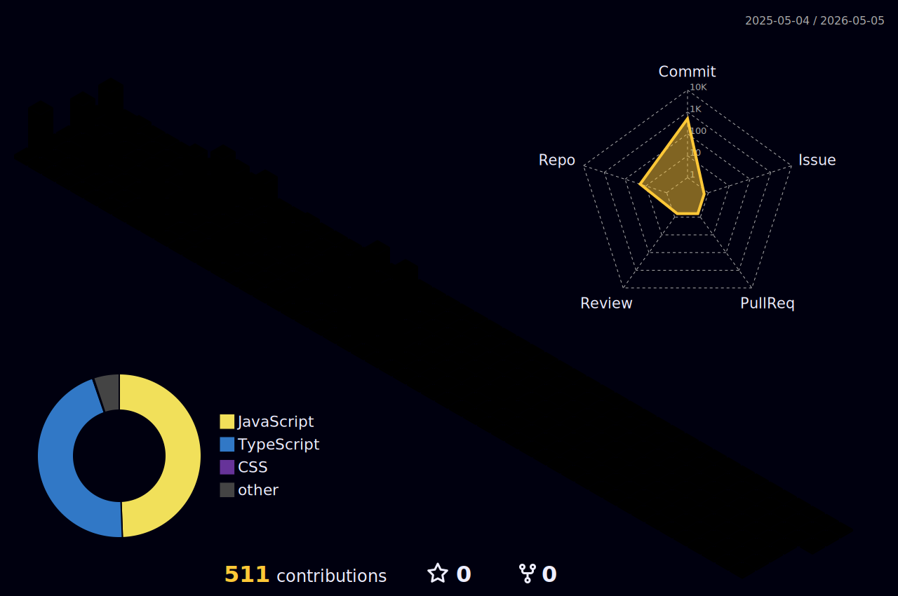

  

<h1 align="center">
  
</h1>

---

## 🚀 Tech Stack

  
  
  
  
  
  
  
  
  
  
  
  
  
  
  
  
  
  
  
  

---

## 💡 Highlights

- 🔐 Secure authentication with **JWT** & **Firebase Auth**
- 🤖 AI chatbot integration using **Dialogflow** & **OpenRouter**
- 🎮 Gamified learning platforms for neurologically diverse children
- 📊 Real-time progress tracking dashboards and analytics
- 🌐 Smooth deployment via **Vercel**, **Netlify**, and **Render**

---

## 📈 GitHub Stats

  
  

---

## 🏙️ GitHub Contribution Skyline

  

---

## 🔗 Let's Connect

  
<!--    -->
  
  

---

> _“I don’t just build apps—I build experiences that solve real problems.”_
