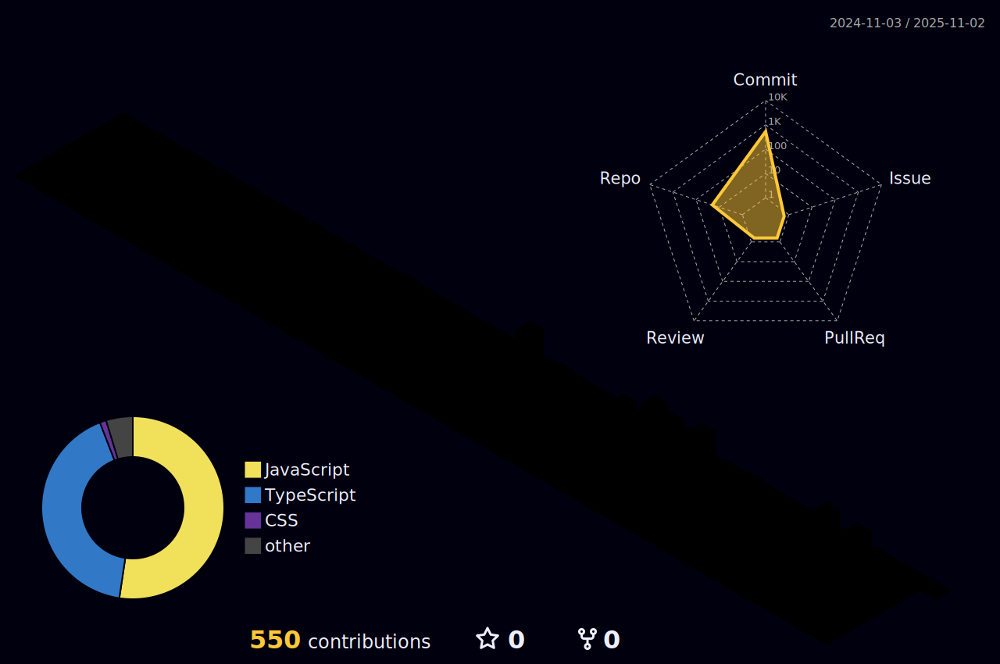

# 👋 Hi, I'm Atheek Rahman

A passionate **Full-Stack Web Developer** building **scalable**, **secure**, and **modern** web applications. I specialize in the **MERN stack**, real-time features, AI chatbot integrations, and crafting clean, user-friendly UI/UX.

---

## 🚀 Tech Stack

### 🧩 Frontend

### 🛠️ Backend

### ⚙️ Tools & DevOps

---

## 💡 Highlights

- 🔐 Secure authentication with **JWT** & **Firebase Auth**
- 🤖 AI chatbot integration using **Dialogflow** & **OpenRouter**
- 🎮 Gamified learning platforms for neurologically diverse children
- 📊 Real-time progress tracking dashboards and analytics
- 🌐 Smooth deployment via **Vercel**, **Netlify**, and **Render**

---

## 📈 GitHub Stats

  

---

## 🏙️ GitHub Contribution Skyline

## 🔗 Let's Connect

  
  
)

---

> _“I don’t just build apps—I build experiences that solve real problems.”_

